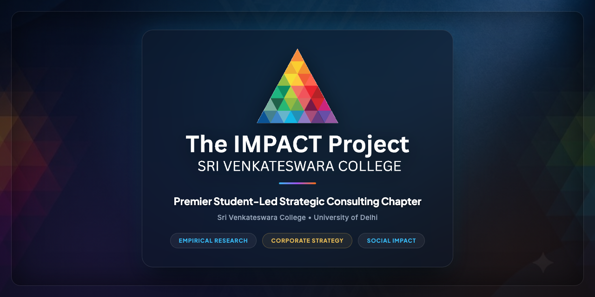

  

    

  <h1>The IMPACT Project</h1>
  <h3>Sri Venkateswara College • University of Delhi</h3>

  

    <em>From Learning To Making An Impact</em>
  

  

    <strong>Strategic, data-driven student consulting chapter solving complex growth, marketing, and operational challenges for corporate startups, social enterprises, and NGOs globally.</strong>
  

  

    <a href="https://manandewan.github.io/TIP-Website/"><strong>🌐 Live Website Preview</strong></a> •
    <a href="https://www.linkedin.com/posts/theimpactprojectsvc_indian-brokerage-industry-reporttip-activity-7442837967922196480-zFMK"><strong>💼 LinkedIn Official Post</strong></a>
  

---

## 📌 Core Specializations

- **Empirical Research:** Primary market surveys, consumer behavior mapping, pricing elasticity, and competitor benchmarking.
- **Corporate Strategy:** GTM roadmaps, omnichannel user acquisition, marketing funnel optimization, and UI/UX friction audits.
- **Capital Scaling:** Non-profit grant roadmaps, volunteer acquisition funnels, and automated budgeting allocation models.

## 📁 Key Projects Featured

| Client | Domain | Strategic Scope |
| :--- | :--- | :--- |
| **Chefling** | Startup (Shark Tank S3) | Instant Ramen GTM launch & push notification CTR strategy |
| **Ketto** | Crowdfunding Corporate | Donor trust indicators, price sensitivity & product tiers |
| **RentEagle** | Lifestyle Rentals | Event management unit feasibility & supply chain models |
| **Sadagamaya** | Healthcare NGO | Blood drive behavioral research & dynamic budgeting model |
| **DOR Foundation** | Social Welfare NGO | Volunteer acquisition funnel & grant funding strategy |
| **1in.me** | Self-Expression Platform | International expansion benchmarking & cause marketing |

---

## 🛠️ Tech Stack

- **Semantic HTML5** & **Modern CSS3** (CSS custom properties, glassmorphism, flexbox, CSS Grid)
- **Vanilla JavaScript** (Scroll observers, category filtering, slide-over drawer modals, count-up animations)
- **Responsive PWA Assets** (Web App Manifest, Apple Touch Icons, Maskable Icons, multi-resolution Favicons)
- **Open Graph & Twitter Cards** (Rich 1200x630 social preview banners for link sharing)

---

  © 2026 The IMPACT Project, Sri Venkateswara College. All rights reserved.

